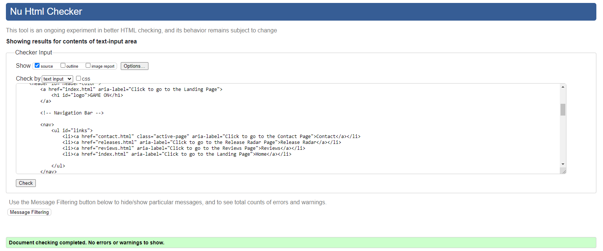

<h1 align="center">Gaming News Website</h1>

[View the live project here](https://bog8dan.github.io/Gaming-News/)

## Index – Table of Contents

- [Index – Table of Contents](#index--table-of-contents)
- [Introduction](#introduction)
- [User Experience (UX)](#user-experience-ux)
- [Features](#features)
  - [Existing Features](#existing-features)
  - [Features which could be implemented in the future](#features-which-could-be-implemented-in-the-future)
- [Issues and Bugs](#issues-and-bugs)
- [Technologies Used](#technologies-used)
  - [Main Languages Used](#main-languages-used)
  - [Frameworks, Libraries \& Programs Used](#frameworks-libraries--programs-used)
- [Testing](#testing)
- [Deployment](#deployment)
  - [Deploying on GitHub Pages](#deploying-on-github-pages)
- [Credits](#credits)
  - [Content](#content)
  - [Code](#code)

## Introduction
GAME ON is a website dedicated to the latest gaming news, reviews, upcoming releases and more. GAME ON's main goal is to keep you up to date with the latest news and reviews about your favorite gaming titles as well as updateing you on the upcoming games releasing in the near future. If you are a gaming addict or just lookin gfor the latest information we've got you covered.

## User Experience (UX)

  - ### User stories

  - ### Ideal User Demographic
    - First Time user
    - Current user
    - Frequent User

  - ### First Time User Goals

        1. As a First Time User, I want to easily explore website content.
        2. As a First Time User, I want to easily to understand what the website offers.
        3. As a First Time User, I want to easily navigate throughout the website pages.

  - ### Current User Goals

        1. As a Current User, I want to visit easily and fast the website.
        2. As a Current User, I want to easily book a offer.
        3. As a Current User, I want to easily contact the companie.

  - ### Frequent User Goals

        1. As a Frequent User, I want to see regular gaming news updates.
        2. As a Frequent User, I want to see videos with the latest trailers.

- ### Development-Planes

  - #### To create an accessible and easy-to-use website

        1. Create a clear and logical structure.
        2. Choose good colors and fonds.
        3. Implement a responsiv design.

  - ### Strategy

        1. Define Target Audience.
        2. Use-Friendly navigation.
        3. Create relevant content.
        4. Use attractive and high-quality images.
        4. Integrate Social Media.

  - ### Scope

        1. Update content on a dayly basis.
        2. Keep the visitors interested in the content.
        3. Repeat visits from users.

- ### Design

  - #### The color palette used in the website

        1. Primary Color: ghostwhite;
        2. Secundary Color: darkslategrey.
        3. Accent Color: crimson.
        4. Background Color: gainsboro.
        5. Text Color: black.
        6. Border Color: rgba(199, 74, 74, 0.7).
        7. Shadow Color: rgba(255, 0, 0, 0.7).

- ### Typography

  - #### The typography used in the website

        1. Primary Font: [Source Sans Pro](https://fonts.google.com/specimen/Source+Sans+Pro)
    - Imported from [Google Fonts](https://fonts.google.com/)

- ### Media Files, Text and Tools

  - #### The Media Files used in the website

        1. [Images](https://google.com/)
        2. [Videos](https://youtube.com/)
        3. [Articles](https://ign.com/)
        4. [Releases](https://gamerant.com/)

## Features

### Existing Features

- __Navigation Bar__

  - The navigation bar is constant and appears on all pages of the site and on all resolutions.
  - The navigation bar has a pleasing contrast to the eye and it provides easy access to different pages of my website.

- __Index page__

    - Contains the main content and news articles

- __Reviews page__

    - Contains the article reviews and trailers

- __Releases page__

    - Contains the relase radar for upcoming titles

 __Contact Page - 'Contact Form' and Find us__

    - The Contact page consists of a 'Contact Form' panel and a Google map panel.

- __Footer__

  - The footer is constant and appears on all pages of the site and on all resolutions. At low resolution the footer is positioned in the column.

### Features which could be implemented in the future

- #### Login Page
  - A Login Page could be added to secure the account of the user and to protect sensitive information.

- #### Bookmark feature
  - The Bookmark functionality could be added because is a great way to allow users to save their favorite articles and videos.

- #### Hardware Page
  - A Hardware page could be added to show the minimum harware requirements to run the latest games.

## Issues and Bugs

- ### Solved
  - The color of the navaigation bar doesn't occur.
    - Fixed by adding 'overflow: auto' to the navigation body
  - Fix the order list of the navigation bar.
    - Fixed by reversing the order of the menu list.
  - Fix the image text aligment of the landing image from the Index Page.
    - Fixed by adding the image text in the same division with the landing image. Set the position to relative, set the content to be centered and set the item position to be at the bottom of the landing image.
  - Fix the text position of the cards from the Index Page.
    - Fixed by setting the text align to be in the center.
  - Fix adjusting video iframe margins on the screen
    - Fixed by adding margin to auto.
  - Fix adjusting the image margins on the Releases page.
    - Fixed by modifying the max-width.

  - ! All fixed was resolve with the help of the Stack OverFlow or W3Schools websites.

## Technologies Used
### Main Languages Used
-   [HTML5](https://en.wikipedia.org/wiki/HTML5)
-   [CSS3](https://en.wikipedia.org/wiki/Cascading_Style_Sheets)

### Frameworks, Libraries & Programs Used

- [Google Fonts:](https://fonts.google.com/) was used to import the 'Source Sans Pro' font into the style.css file.
- [Font Awesome:](https://fontawesome.com/) was used to add icons.
- [GitHub:](https://github.com/) is used as the respository for the projects code after being pushed from Git.
- [W3Schools:](https://w3schools.com/) was used to create the color palette.

## Testing

- [HTML Validator](https://validator.w3.org/)
  - result for index.html
        
  - result for reviews.html
        
  - result for releases.html
        
  - result for contact.html
        

- [CSS Validator](https://jigsaw.w3.org/css-validator/)

  - result for styles.css
      

## Deployment

- This project was developed using [GitPod](https://www.gitpod.io/) and [CodeAnyWhere](https://codeanywhere.com/).
- I have used the terminal to commit changes in my GitHub repository.

### Deploying on GitHub Pages
To deploy this page to GitHub Pages from its GitHub repository, the following steps were taken:

1. Log into [GitHub](https://github.com/login "Link to GitHub login page") or [create an account](https://github.com/join "Link to GitHub create account page").
2. Locate the [GitHub Repository](https://github.com/Bog8dan/Gaming-News "Link to GitHub Repo").
3. At the top of the repository, select Settings from the menu items.
4. Scroll down the Settings page to the "Pages" section.
5. Under "Source" click the drop-down menu labelled "None" and select "Main".
6. Upon selection, the page will automatically refresh meaning that the website is now deployed.
7. Scroll back down to the "Pages" section to retrieve the deployed link.

## Credits 

### Content 

- The ReadME file was inspired from [Survival-Guild Project](https://github.com/Irishbecky91/survival-guild/blob/main/README.md#) and [Thrive Juices Project](https://github.com/elainebroche-dev/ms1-thrive)
- [Article](https://www.123helpme.com/essay/The-Perfect-European-Vacation-224696)
- All other content was written by the developer

### Code

- [Parallax](https://www.w3schools.com/howto/tryit.asp?filename=tryhow_css_parallax_percent)
- [Modal Container](https://www.tutorialspoint.com/how-to-align-the-modal-content-box-to-the-center-of-any-screen?fbclid=IwAR0B5UzubrLahMMh2J2dPcV9jevHQ9C2cuEL2E28yHhAm4tnft9KEO8RM8E) [and](https://www.w3schools.com/w3css/tryit.asp?filename=tryw3css_modal_login)
- [Center Modal](https://www.tutorialspoint.com/how-to-align-the-modal-content-box-to-the-center-of-any-screen?fbclid=IwAR0B5UzubrLahMMh2J2dPcV9jevHQ9C2cuEL2E28yHhAm4tnft9KEO8RM8E)
- [Animation](https://www.w3schools.com/w3css/tryit.asp?filename=tryw3css_modal4)
- [Cards](Inspired from: <https://www.w3schools.com/howto/howto_css_cards.asp>)
- [Landing image text](https://github.com/Code-Institute-Solutions/love-running-2.0-sourcecode/tree/main/03-creating-the-hero-image/03-hero-image-cover-text)
